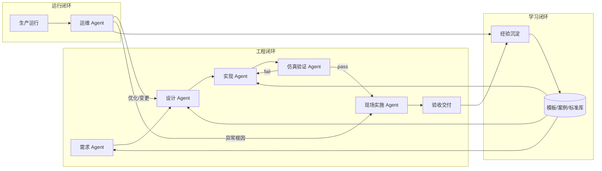
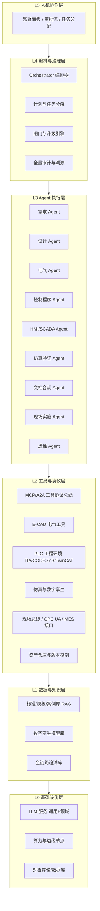
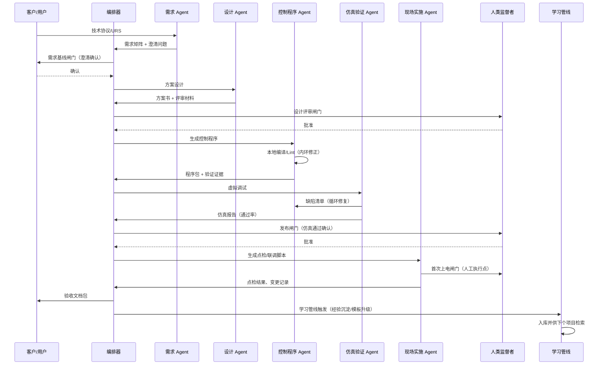

# 工业自动化生产系统工程落地之全程 AI Agent 全自动自主闭环设计架构

> 版本：v1.1（设计稿）
> 定位：面向工业自动化生产系统（PLC/DCS/SCADA/机器人/视觉/MES 集成）工程项目全生命周期——从需求到运维——由多智能体（Multi-Agent）自主完成并闭环自洽的架构设计方案。
> 读者：自动化工程公司技术负责人、数字化部门架构师、产品经理、AI 工程团队。
> 修订记录（v1.1）：依据独立审阅报告增补——新增执行摘要、成本模型与 ROI（8.5）、多项目并行调度（3.10）、模型与提示词版本治理（7.5）、变更影响分析实现（4.4）、知识库冷启动（6.2）、灾难恢复（5.5）；指标细化（8.1/9）；补 IEC 62061 与 IEC 62443-4-1；修正措辞与附录引用；增补失败路径走查（附录 A.2）。

## 执行摘要（面向决策层）

- **问题**：工业自动化项目交付周期长、依赖个人经验、知识复用率低。
- **方案**：构建多 Agent 体系，以"验证即门禁"为核心，实现需求→设计→编程→仿真→部署→运维的全链路自主闭环。
- **核心原则**：模型负责生成，确定性工具负责裁决，人类负责把关；安全与正确性不押在概率输出上。
- **预期收益**：项目周期缩短 ≥40%，现场调试工时压缩 ≥50%，知识复用率 ≥60%。
- **落地路径**：四阶段渐进（助手→半自动→受限全自动→学习型全自动），从控制程序生成单点切入。
- **投资估算（示例）**：¥115–245 万初始投入，1.5–2.5 年回收（10 项目/年规模，见 8.5）。
- **红线**：安全事故数为 0；SIL3+ 安全功能不自动生成；危险操作永远人工闸门。

## 1. 目标与范围

### 1.1 问题与目标

传统工业自动化项目工程周期长、高度依赖资深工程师的个人经验，需求变更与现场调试反复迭代，知识沉淀差、复用率低。本架构的目标是：让 AI Agent 体系成为"工程主体"而非"单点工具"，以可验证、可追溯、可回滚的方式，自主完成从客户需求到交付运维的全程闭环。

具体目标（量化基线见第 9 节）：

- 项目交付周期缩短 40% 以上，现场调试工时压缩 50% 以上；
- 需求到程序/图纸的全链路可追溯（每条需求可定位到实现与测试证据）；
- 生成产物的质量由确定性验证器（编译器、仿真、规范检查）强制把关，而非依赖模型自觉；
- 人工介入次数与点位收敛为预先声明的"闸门"，全部留痕可审计；
- 项目经验自动沉淀为模板与案例库，形成随项目数量增长而增强的学习闭环。

### 1.2 范围界定

"全程"覆盖工程生命周期的以下阶段，每个阶段由专职 Agent 负责，并由编排器统一调度：

| 阶段 | 传统产出 | Agent 体系的产出 |
| --- | --- | --- |
| 需求工程 | 技术协议、URS、需求清单 | 结构化需求矩阵、可追溯链接、缺口问题清单 |
| 方案设计 | 控制方案、选型、网络拓扑 | 方案文档、IO 估算、SIL/风险初评、评审材料 |
| 工程实现 | 电气图、PLC 程序、HMI/SCADA | 电气图纸、IEC 61131-3 程序、组态工程、BOM |
| 仿真验证 | 人工试车 | 数字孪生虚拟调试、自动测试用例、验证报告 |
| 现场实施 | 现场调试记录 | 下载/点检/联调脚本、诊断报告、变更记录 |
| 验收交付 | 竣工文档、验收报告 | 自动生成文档包、合规检查、验收证据链 |
| 运行运维 | 人工巡检、经验排障 | 异常根因分析、预测性维护、优化建议（回灌设计） |

不在本版范围内的：运动轨迹示教等强物理交互任务的全自主执行（仅辅助）、SIL 3 及以上安全相关功能的自动生成（仅生成草案，人工认证）、涉及压力容器等特种设备监管事项的自动签批。

### 1.3 设计原则

1. **验证即门禁（Verify-as-Gate）**：任何 Agent 产出必须通过可执行验证器后才允许流入下一阶段；验证器必须是确定性的（编译器、Lint、仿真、规范检查、双 Agent 交叉评审仅作为辅助证据，不作为放行依据）。
2. **模型只管生成，系统负责正确性**：LLM 负责"提出候选"，确定性引擎负责"裁决"；绝不把安全与正确性押在概率输出上。
3. **人机边界显式化**：自动化水平分级、强制人工闸门、审批链在架构上写死，可配置但不可绕过。
4. **全链路可追溯**：需求→设计→实现→测试→现场变更，全程单一数据源（Single Source of Truth），每条记录带 ID、作者（Agent/人）、时间、依据。
5. **资产即代码**：图纸、程序、组态、测试用例全部文本化/结构化并纳入版本控制，Agent 的一切修改可 diff、可回滚。
6. **渐进自主**：自动化等级随证据积累逐级提升（第 8 节），不一步到位。
7. **失败要响亮**：验证失败、工具不可用、模型置信度不足一律显式上报，禁止静默降级。

### 1.4 术语

- **工程闭环**：需求→设计→实现→验证→交付的迭代环。
- **运行闭环**：生产运行数据→诊断/优化→再部署的迭代环。
- **学习闭环**：项目经验→案例/模板/标准库→下次项目复用。
- **闸门（Gate）**：阶段间的人工审批点，附自动化检查结果供人裁决。
- **验证器（Verifier）**：确定性检查工具（编译、仿真、规范检查等），输出 pass/fail 与证据。
- **DAG**：有向无环图，用于建模任务依赖与调度。
- **RAG**：检索增强生成，从知识库检索相关片段辅助模型生成。
- **MCP**：Model Context Protocol，Agent 调用外部工具的标准化协议。
- **A2A**：Agent-to-Agent 协议，Agent 间任务协商协议。
- **SIL**：安全完整性等级（Safety Integrity Level），IEC 61508 定义。
- **HAZOP / FMEA**：危险与可操作性分析 / 失效模式与影响分析。
- **E-CAD**：电气计算机辅助设计（如 EPLAN）。
- **ST / SFC**：结构化文本 / 顺序功能图，IEC 61131-3 编程语言。
- **SIMIT**：西门子仿真平台。
- **Openness**：TIA Portal 的自动化编程接口。
- **FAT / SAT / VAT**：工厂验收测试 / 现场验收测试 / 虚拟验收测试。

## 2. 总体架构

### 2.1 三闭环总览

系统由三个嵌套闭环构成：工程闭环是主体（自动化程度逐级提升），运行闭环把生产现场数据反哺工程，学习闭环让体系随项目增长而增强。

### 2.2 分层架构

各层职责：

| 层 | 职责 | 关键约束 |
| --- | --- | --- |
| L5 人机协作 | 呈现 Agent 工作状态、待审批闸门、人工任务队列 | 人只通过预定义入口介入，介入动作全部留痕 |
| L4 编排治理 | 项目计划生成与任务分解、Agent 调度、失败升级、全程审计 | 状态机驱动；闸门不可被 Agent 自身绕过 |
| L3 执行 | 各专业领域 Agent 完成具体工程任务 | 每个 Agent 的产出必须带可验证产物与元数据 |
| L2 工具协议 | 统一封装工程软件能力为工具调用（MCP 等协议） | 工具只暴露受控操作；危险操作强制二次确认 |
| L1 数据知识 | 标准库、模板、历史案例检索、数字孪生模型、追溯数据 | 版本化；检索结果带出处，供追溯 |
| L0 基础设施 | 模型推理、计算、存储；支持现场边缘部署 | 现场可离线（见 7.3） |

### 2.3 核心机制：可执行验证门禁

所有阶段间流转统一走"生成 → 验证 → 放行/驳回"管线。验证器按专业分域：

| 专业域 | 验证器示例 | 输出证据 |
| --- | --- | --- |
| 控制程序 | PLC 编译器/语法检查（如 TIA Openness 导入编译、CODESYS 编译）、Lint（命名、未用变量、禁止指令） | 编译日志、Lint 报告 |
| 电气设计 | E-CAD 规则检查（短路、未连接端子、物料库校验） | 规则检查报告 |
| 需求 | 完整性检查（每条需求有实现与测试）、一致性检查（无冲突术语） | 追溯矩阵、缺口报告 |
| 仿真 | 数字孪生虚拟调试用例执行（节拍、联锁、报警） | 仿真通过率、时序数据 |
| 安全 | 标准符合性清单（IEC 61511/ISO 13849/IEC 62061 相关条款初查） | 符合性初查表（人工终审） |
| 网络 | IEC 62443 分区检查、未授权端口清单 | 配置审计报告 |

双 Agent 交叉评审（一个生成、一个按规范挑错）作为辅助证据，不替代确定性验证器。所有验证结果进入追溯库，成为阶段放行的唯一凭证来源。

## 3. 核心 Agent 模块设计

统一约定：每个 Agent 的输入、输出、工具、验证标准在元数据中声明，编排器据此调度与验收。以下为各专职 Agent 的设计要点。

### 3.1 需求工程 Agent

- **职责**：把客户技术协议、URS、会议纪要、既有图纸等非结构化输入转为结构化需求矩阵。
- **输入**：招标文件、技术协议、URS、口头需求录音转写、参考项目资料。
- **输出**：需求矩阵（ID、描述、优先级、验证方式、关联风险）、待澄清问题清单（自动列出矛盾与缺失）、需求基线提案。
- **工具**：文档解析（含 PDF/图纸 OCR）、RAG 检索标准与历史案例、需求库写入。
- **验证**：完整性（每条需求可追溯至来源段落）、一致性（术语统一、无互斥约束）、可测性（每条需求有明确验证方式）。输出进入需求基线闸门（人工确认，见 5.2）。

### 3.2 方案设计 Agent

- **职责**：工艺理解、控制架构选型、IO 清单估算、网络拓扑、风险初评。
- **输入**：需求基线、工艺流程图/设备清单、场地条件。
- **输出**：控制方案书（架构图、PLC/DCS 选型建议、伺服/机器人/视觉配置、IO 估算表、网络拓扑、SIL 初评表）、方案评审材料。
- **工具**：设备库与价格库检索、拓扑绘制工具、RAG 检索类似项目方案。
- **验证**：IO 估算与设备清单一致性、拓扑可达性检查、SIL 初评条款覆盖。方案进入设计评审闸门（人工确认）。

### 3.3 电气与硬件设计 Agent

- **职责**：电气原理图、IO 清单、端子图、柜体布置、BOM 生成。
- **输入**：方案基线、设备手册、电气标准库。
- **输出**：E-CAD 工程文件（结构化）、IO 清单（与控制程序变量映射一致）、BOM、图纸目录。
- **工具**：E-CAD API（EPLAN/CAD 类）、物料库、图纸解析（多模态）。
- **验证**：E-CAD 规则检查、IO 清单与控制程序符号表双向一致性校验、BOM 物料存在性校验。

### 3.4 控制程序生成 Agent

- **职责**：按 IEC 61131-3（ST/SFC 等）生成 PLC 程序、变量映射、安全程序草案。
- **输入**：需求矩阵中控制相关条目、IO 清单、设备手册（功能码、时序要求）、既有模板库。
- **输出**：结构化程序（组织块/功能块划分、命名规范、注释）、符号表、程序文档。
- **工具**：PLC 工程环境自动化接口（TIA Portal Openness、CODESYS Automation Interface、TwinCAT ADS/自动化接口）、模板库检索、代码 Lint。
- **验证**：编译通过、Lint 通过、模板符合度、与 IO 清单符号一致性；关键联锁逻辑进入仿真验证（3.6）。此 Agent 是当前业界验证案例最多、工具链最成熟的环节，采用"生成→本地编译验证→修正"内环，见第 4 节与附录 B 参考案例。

### 3.5 HMI/SCADA 组态 Agent

- **职责**：生成 HMI 画面、报警/趋势组态、SCADA 变量连接。
- **输入**：需求中操作界面条目、IO 清单、画面规范模板。
- **输出**：HMI/SCADA 工程（画面、报警表、历史趋势、权限）、操作手册草案。
- **工具**：组态软件 API（WinCC/FactoryTalk/InTouch 等）、画面模板库、控件规范。
- **验证**：组态工程导入编译、变量引用完整性（每个画面对象有对应变量）、报警与程序报警代码一致性、画面走查用例（与仿真联动）。

### 3.6 仿真验证 Agent（虚拟调试）

- **职责**：搭建数字孪生/行为模型，自动生成并执行测试用例，完成虚拟调试闭环。
- **输入**：控制程序、IO 清单、设备行为模型库（气缸、伺服、输送线、机器人等）、节拍要求。
- **输出**：测试用例集（正常流程、边界条件、故障注入）、仿真执行报告、缺陷清单与定位建议。
- **工具**：仿真平台（PLC 仿真器 + 工厂行为仿真，如 Factory IO、SIMIT、TwinCAT 仿真、通用 co-simulation 框架）、测试编排器。
- **验证**：用例通过率、关键联锁全覆盖（需求逐条映射到用例）、故障注入响应符合预期；行为级验证（强制输入 + 变量轨迹追踪，参考 SemaPLC 思路）作为补充证据。仿真未覆盖的需求条目显式列出，不得"静默跳过"。

### 3.7 文档与合规 Agent

- **职责**：自动生成技术文档包（说明书、操作手册、竣工图目录、验收报告）、标准符合性初查、风险评估辅助（HAZOP/FMEA 条目初拟）。
- **输入**：全链路工程资产、标准库、验收模板。
- **输出**：文档包（每份文档标注生成依据与待人工确认项）、符合性检查表、风险登记册草案。
- **工具**：文档模板引擎、标准库检索、追溯库查询。
- **验证**：文档与工程资产一致性（引用的 IO 点、程序版本、图纸版本均存在且为最新）、模板完整性检查。

### 3.8 现场实施与调试 Agent

- **职责**：生成下载与点检脚本、联调步骤清单、根据现场反馈诊断问题并给出修复建议。
- **输入**：验证通过的工程包、现场信号点检数据、实时运行数据（OPC UA/诊断缓冲）。
- **输出**：下载/点检/联调脚本（人工执行或经授权执行）、诊断报告、变更申请（进入变更审批）。
- **工具**：PLC 在线接口（受限权限）、OPC UA 客户端、诊断缓冲读取、相机/传感器数据接入（多模态）。
- **验证**：每步脚本预演（离线校验）、执行结果比对期望值、异常自动捕获并生成诊断证据。
- **注意**：涉及首次上电、带能动作的步骤列为人工闸门（见 5.2），Agent 只负责准备与事后核对。

### 3.9 运行运维 Agent

- **职责**：生产运行异常根因分析、预测性维护建议、节拍/能耗/参数优化建议，形成变更提案回灌工程闭环。
- **输入**：实时工艺数据、报警与事件历史、设备台账、维护记录。
- **输出**：根因分析报告（附证据）、优化提案（如 PID 整定建议、节拍优化、备件预警）、变更申请草案。
- **工具**：时序数据库查询、OPC UA 订阅、诊断知识库 RAG、机理模型/统计模型。
- **验证**：提案必须附数据证据与影响评估；优化类变更走完整"生成→仿真验证→审批→部署"闭环，禁止直接在线修改。

### 3.10 编排器（Orchestrator）

- **职责**：项目级任务分解与依赖管理、Agent 调度、失败升级、闸门流转、状态机维护。
- **核心机制**：项目计划建模为有向无环图（DAG），每节点绑定 Agent、验证器、闸门；失败重试与升级策略在节点元数据中声明。
- **治理约束**：编排器自身无权批准闸门；无法决策的路径冲突升级给人类监督者并附选项与依据。
- **多项目并行约束**：
  - 每个项目实例独立隔离（工作空间、追溯库、权限域）；
  - 共享资源（模型推理、仿真节点）按优先级队列调度；
  - 跨项目知识检索需脱敏（项目 A 的专有工艺不得泄露给项目 B 的 Agent 上下文）；
  - 编排器支持"项目模板"实例化：标准产线项目可从模板一键生成 DAG 骨架。

## 4. 闭环机制设计

### 4.1 内闭环（自动修复环）

单阶段失败自动修正：`生成 → 验证 fail → 诊断 Agent 分析错误 → 生成修复 → 重验`，重试次数与预算由策略限制（默认 3 次），超出即升级。诊断 Agent 复用验证器输出（编译错误行号、仿真偏差曲线、规则违反条目）作为修复输入，保证修复有据可依。

### 4.2 外闭环（人工介入环）

内闭环耗尽、验证器不可用、模型置信度不足、或节点标记为强制人工闸门时，升级至监督者。升级包必须包含：任务上下文、当前产物与验证证据、失败原因分析、候选方案（若有）。人工裁决结果（通过/驳回/修改指示）回写状态机并进入追溯库，同时成为后续学习样本。

### 4.3 学习闭环（经验沉淀环）

项目结束后自动沉淀：

- 通过验证的工程产物 → 模板库（带项目上下文标签）；
- 验证失败与修复对 → 案例库（失败模式 + 修复方法，供 RAG 检索）；
- 人工裁决记录 → 规则库（沉淀为 Lint/检查规则或提示词约束）；
- 现场变更 → 变更案例库（需求阶段可检索"同类项目常见现场变更"，前置规避）。

沉淀由"学习管线"自动完成初筛与去重，人工定期审核入库，避免污染知识库。

### 4.4 全链路可追溯与版本化

- 所有工程资产（需求、图纸、程序、组态、测试、文档）文本化/结构化存入版本仓库，Agent 与人均以变更请求（Change Request）方式提交。
- 每次生成记录：输入版本、模型与提示词版本、验证证据、Agent/人身份、时间戳。
- 需求追溯矩阵自动维护：需求 ↔ 设计条目 ↔ 实现（程序块/图纸页）↔ 测试用例 ↔ 现场变更，任一环节变更自动标出受影响下游条目。
- **变更影响分析实现**：追溯矩阵建模为有向图（需求节点→设计节点→实现节点→测试节点）；变更发生时沿图正向遍历所有下游可达节点，标记"受影响"。影响分三级——直接影响（同一节点产物需重新生成，自动触发重新生成+验证）、间接影响（下游节点需重新验证，进入待办队列）、潜在影响（语义相关但无直接链接，由模型辅助判断 + 人工确认，仅提醒）。

### 4.5 闭环时序示例（需求到现场交付）

## 5. 人机边界与安全治理

### 5.1 自动化水平分级

按介入程度划分四个等级，项目按场景选择等级（默认从 A1 起步）：

| 等级 | 名称 | Agent 权限 | 人工角色 |
| --- | --- | --- | --- |
| A0 | 辅助 | 生成草案、检索、检查 | 人完成全部决策与实现 |
| A1 | 受控半自动 | 生成+验证+自动修复，闸门前停 | 人批闸门、终审 |
| A2 | 受限全自动 | A1 + 闸门由规则自动放行（预设标准项目） | 人仅例外介入、抽查 |
| A3 | 学习型全自动 | A2 + 运维优化提案自动进入闭环 | 人治理知识库与规则 |

等级升级条件见第 8 节。危险操作（首次上电、带能动作、在线强制变量、安全程序修改）在任何等级下都是人工闸门，不随等级放开。

### 5.2 强制人工闸门清单（不可配置移除）

1. 需求基线确认；
2. 方案设计评审（含选型与安全初评）；
3. 安全相关功能（SIL 评级）的生成物终审——必须由具备资质的认证工程师确认；
4. 现场首次上电与带能动作的执行（Agent 只做脚本与核对）；
5. 验收签字；
6. 任何影响生产在线的变更部署。

A1 典型项目闸门总数约 6–8 个（上述 6 项 + 项目特设闸门），作为人工介入预算的基准（见第 9 节）。

### 5.3 标准与合规框架

- 功能安全：安全相关系统设计遵循 IEC 61511（过程）/ISO 13849、IEC 62061（机械）；Agent 仅生成草案与符合性初查，认证决策由人负责。
- 网络安全：遵循 IEC 62443 分区与纵深防御；Agent 生成的程序/组态同样遵循 IEC 62443-4-1 安全开发生命周期要求；Agent 操作限定在授权的工程区，现场网络变更需审批。
- 质量：工程文档与记录遵循项目质量体系（如 ISO 9001 相关程序），全程留痕以支持审计。

### 5.4 权限、审计与责任

- Agent 以独立身份运行，权限最小化：工程区读写、生产网只读、在线写入需审批。
- 全量决策日志（输入、输出、验证、闸门裁决、人工介入）加密存证，支持按项目导出审计包。
- 责任划分写进流程文件：Agent 负责生成与自验证，人类闸门负责放行决策；事故追溯以日志为证据链。

### 5.5 灾难恢复与业务连续性

- 编排器与闸门服务主备部署，状态机与任务队列持久化，切换不丢进行中任务。
- 工程资产仓库多副本 + 异地备份；示例目标 RPO ≤ 24 小时、RTO ≤ 4 小时（按企业实际校准）。
- 模型服务中断降级：关键验证器（编译/Lint/规范检查）本地化部署、不依赖模型；模型接入多路冗余（主/备供应商）。
- 知识库定期快照；恢复演练每季度一次。
- 事故后按 5.4 审计链恢复现场状态与责任认定。

## 6. 数据与知识层

### 6.1 单一数据源与追溯矩阵

需求库、工程资产仓库、追溯库、验证证据库四库联动，以需求 ID 为主键贯通全生命周期；下游只引用上游基线版本，杜绝"图纸与程序两张皮"。

### 6.2 标准/模板/案例库（RAG）

- 标准库：GB/IEC/ISO/VDI 相关标准的结构化条款与检查清单；
- 模板库：经审核的成熟工程模板（程序框架、画面规范、文档模板）；
- 案例库：历史项目、失败-修复对、现场变更案例。
- 检索结果必须带出处与版本，供生成引用与人工复核；检索命中率低的领域标记为"知识空白"，触发补库任务。

**冷启动策略**：

1. **种子库构建**（阶段一完成前）：从企业历史项目提取 ≥20 个已验证程序模板；整理 ≥5 套行业标准检查清单（如 GB/T 15969、IEC 61131-3 命名规范）；人工编写 ≥10 个典型案例（含失败-修复对）。
2. **最小可用规模**：模板库 ≥20 条、案例库 ≥30 条、标准库覆盖主营业务领域；低于此规模时 RAG 命中率不足，Agent 退化为"纯生成模式"（无检索增强），须在监控面板显式标示。
3. **质量门控**：初始入库由资深工程师逐条审核；后续增量走"学习管线初筛 + 人工抽检"（抽检率 ≥20%）。

### 6.3 数字孪生

设备行为模型库（气缸、伺服、输送、机器人、安全设备）支撑虚拟调试；模型与真实设备数据持续校准（运行闭环反哺），使仿真可信度随项目提升。

### 6.4 数据流总览

客户输入与现场数据 →（解析/结构化）→ 需求矩阵 →（设计）→ 工程资产 →（生成）→ 验证证据 →（交付）→ 运行数据 →（诊断/优化）→ 变更提案 → 回灌设计与知识库。

## 7. 关键使能技术

### 7.1 模型能力与选型

- 主生成模型：通用大模型承担需求解析、方案起草、代码生成；领域微调/适配提升 IEC 61131-3、E-CAD 与厂商平台语料的准确率。
- 结构化输出：结构化元数据（任务结论、需求条目、清单、报告）强制 JSON Schema 校验（在解析边界验证）；代码、图纸等工程产物以文件形式输出，由对应确定性验证器裁决。杜绝"看起来对"的自由文本流入下游。
- 多模态：图纸理解（电气图、P&ID、布置图）、现场照片诊断、界面截图理解。
- 证据导向：关键结论必须附引用来源或验证证据，降低幻觉危害。

### 7.2 确定性验证引擎

编译器、Lint、E-CAD 规则检查、仿真器、规范检查器构成"裁决层"，是系统正确性的底线；安全关键逻辑可引入形式化验证（模型检测，如 nuXmv/PLCverif，参见附录 B）作为高阶手段。验证器选型以"能被工具链自动化调用"为硬条件；不具备自动化接口的验证环节暂缓纳入，宁可人工也不可假自动。

### 7.3 工具协议与工程软件集成

- 统一工具协议（如 MCP/A2A 风格的能力总线）封装各厂商工程环境：TIA Portal Openness、CODESYS Automation Interface、TwinCAT 自动化接口、E-CAD API、仿真平台 API、OPC UA。
- 现场部署形态：云端集中编排 + 边缘节点执行工程任务（离线可用）；涉密项目可整体私有化部署（参见附录 B 中"厂商感知、本地部署"路线与 CERN×西门子 vPLC 联合研究的云边实践）。

### 7.4 多 Agent 编排与记忆

- 编排器按 DAG 调度、状态机流转、失败升级（3.10）；
- 记忆分层：项目内工作记忆（当前上下文与资产状态）、跨项目长期记忆（案例/模板库）、组织级规则记忆（企业规范、审批策略）。

### 7.5 模型与提示词版本治理

- 每次生成已记录模型与提示词版本（4.4），追溯可查。
- 模型升级/切换触发回归验证：对最近 N 个已交付项目的关键产物重新编译/仿真。
- 回归不通过 → 标记"模型兼容性风险"，人工评估是否影响已交付项目；必要时冻结新模型上线。
- 提示词版本纳入版本控制，提示词变更视同代码变更，走变更审批。

## 8. 落地路径（四阶段路线图）

### 8.1 阶段一：AI 助手（A0→A1 起步，1–2 个季度）

- 范围：需求解析、文档生成、程序草案生成 + 本地编译验证内环（先做控制程序单点，收益最直接）、规范检查。
- 退出条件：首次生成编译通过率 ≥ 80%、含内环修复后编译通过率 ≥ 95%、Lint 通过率 ≥ 90%、工程师接受率 ≥ 70%（抽样调查）。

### 8.2 阶段二：受控半自动（A1，2–4 个季度）

- 范围：接通全流程工具链（E-CAD、仿真、HMI），虚拟调试用例自动生成，闸门体系上线，全链路追溯库建成。
- 退出条件：虚拟调试缺陷密度较人工基线下降 30%、现场调试工时下降 30%、追溯覆盖率 100%（所有交付项可追溯）。

### 8.3 阶段三：受限场景全自动（A2）

- 范围：选"标准产线/成熟行业改造"类项目做全自动试点（需求明确、模板覆盖率高、风险可控），规则化闸门自动放行 + 人工抽查。
- 退出条件：试点项目闸门外人工介入 ≤ 2 次/项目、无因 Agent 生成缺陷导致的停机事故、审计无未留痕介入。

### 8.4 阶段四：学习型全自动闭环（A3）

- 范围：运行闭环接通（运维诊断与优化提案自动回灌）、学习管线常态化，扩展至更多行业场景。
- 退出条件：案例库季度增量达标、模板复用率 ≥ 60%、项目周期缩短 ≥ 40% 持续两个季度以上。

每阶段遵循"先单点后全链、先离线后在线、先低风险后高风险"的顺序；任何阶段出现安全事故或重大质量事故即整体降级复盘。

### 8.5 成本模型与 ROI 分析（示例：中型改造项目，按企业实际校准）

初始投入（CAPEX）：

| 项目 | 估算 | 说明 |
| --- | --- | --- |
| Agent 平台开发/集成 | ¥80–150 万 | 含编排器、验证器适配、知识库构建 |
| 工程软件许可（TIA/EPLAN 等） | ¥20–50 万 | 已有则不计 |
| 算力与基础设施 | ¥10–30 万 | 边缘节点 + 模型推理（或 API 调用） |
| 培训与变革管理 | ¥5–15 万 | 工程师转型培训 |
| 合计 | ¥115–245 万 | |

年度收益（以 10 个同类项目/年计）：

| 收益项 | 估算 | 依据 |
| --- | --- | --- |
| 工程人力节省（40% 效率提升） | ¥60–100 万/年 | 等效人力替代（换算系数需按企业实际校准） |
| 现场调试工时节省（50%） | ¥20–40 万/年 | 出差 + 现场人天 |
| 质量成本降低（返工减少） | ¥10–20 万/年 | 一次验收通过率提升 |
| 知识复用边际成本递减 | 逐年递增 | 模板复用率 60%+ |

投资回收期：约 1.5–2.5 年（10 项目/年规模）。此节为示例口径，立项前须按企业人力成本、项目结构与订单量重算。

## 9. 评价指标体系

| 指标 | 定义 | 阶段目标（示例基线，按企业实际校准） |
| --- | --- | --- |
| 首次生成编译通过率 | 首次生成即通过编译的程序占比 | A1 ≥ 80% |
| 含内环修复后编译通过率 | 经内环自动修复后通过编译的程序占比 | A1 ≥ 95% |
| 虚拟调试缺陷密度 | 每千点 IO 在仿真阶段发现缺陷数；基线取同类项目近 3 年人工调试阶段缺陷数均值 | 较基线下降 ≥ 30% |
| 现场调试工时比 | 现场调试工时/项目总工时 | 下降 ≥ 50% |
| 人工介入次数 | 每项目人工作业闸门外的介入次数（A1 典型项目闸门数 6–8 个，对应 5.2） | 闸门外介入 ≤ 2 次/项目 |
| 追溯覆盖率 | 可追溯交付项/全部交付项 | 100% |
| 一次验收通过率 | 首轮验收无重大整改（需修改控制逻辑/安全回路/重新下载程序）的项目占比 | ≥ 80% |
| 模板复用率 | 复用模板资产占比 | ≥ 60% |
| 项目周期缩短率 | 对比同类历史项目均值 | ≥ 40% |
| 安全事故数 | 因 Agent 产物导致的生产/人身安全事件 | 0（红线） |

首次生成 80% 的基线参考 Agents4PLC 公开结果（首次通过率约 70–85%，经多轮修复后可达 95%+，见附录 B）。

## 10. 风险与对策

| 风险 | 影响 | 对策 |
| --- | --- | --- |
| 模型幻觉导致错误设计/程序 | 质量事故、安全风险 | 确定性验证门禁；证据引用强制；双 Agent 评审辅助；高风险域人工终审 |
| 工程软件接口封闭/不稳定 | 工具链中断、假自动 | 选型以可自动化接口为硬条件；接口适配层隔离；无接口环节明确人工承接 |
| 现场数据与离线环境限制 | 现场 Agent 不可用 | 边缘节点部署 + 离线知识包；云端编排、边缘执行 |
| 知识库污染（错误案例入库） | 生成质量退化 | 学习管线自动初筛 + 人工定期审核；入库带版本与出处分级 |
| 人员抵触与技能转型 | 推行失败 | 从助手形态切入；把资深工程师转型为闸门裁决与知识治理者 |
| 责任与合规边界不清 | 法律/认证风险 | 5.4 责任划分写进流程；安全认证由资质人员终审；全量审计存证 |
| 供应商锁定 | 长期成本 | 工具协议层抽象（MCP 等）；多厂商适配；资产文本化便于迁移 |
| 自动化事故后的信任崩塌 | 项目全面回退 | 分级降级机制；事故复盘写入案例库；升级条件收紧 |
| 平台级故障（编排器/存储/模型服务中断） | 项目停滞、数据丢失 | 5.5 灾难恢复与业务连续性机制 |

## 11. 技术选型参考（候选，非背书）

| 层 | 候选 | 说明 |
| --- | --- | --- |
| 主模型 | 通用旗舰 LLM + 领域微调 | 依数据合规选云端或私有化部署 |
| Agent 编排 | 主流多 Agent 框架或自研状态机编排 | 关键在闸门/审计能力，框架须可插拔验证器 |
| 工具协议 | MCP 风格能力总线 + 自研工程工具适配器 | 统一鉴权、限权、审计 |
| PLC 工程 | TIA Portal Openness / CODESYS Automation Interface / TwinCAT 自动化接口 | 程序生成与编译验证的主通道 |
| 仿真 | 平台仿真器（SIMIT、TwinCAT、Factory IO 等）+ 自研行为模型库 | 与程序生成同链路集成 |
| E-CAD | EPLAN/主流 CAD 的自动化接口 | 规则检查优先 |
| 数据 | 对象存储 + 关系库（追溯）+ 向量库（RAG）+ 时序库（运行） | 版本化与审计为主键 |
| 现场接入 | OPC UA、边缘网关 | 只读优先，写入需审批 |

## 12. 总结

本架构的实质是三句话：**模型生成、系统裁决、人类把关**。AI Agent 负责把工程经验规模化地"提出来"，确定性验证器负责把正确性"钉死"，人类从执行者转为闸门裁决者与知识治理者。落地从控制程序生成这一最成熟环节切入，以"验证即门禁"和"全链路可追溯"为地基，按证据逐级放开自动化等级，最终形成工程、运行、学习三环自洽的全程闭环。本版已补齐实施层细节（成本、并行、冷启动、模型治理、灾难恢复），可直接用于项目立项与架构评审。

## 13. 后续版本规划（v2.0 候选）

- 组织变革与角色转型路径（资深工程师→闸门裁决者/知识治理者的培训方案）；
- 供应商评估与选型决策矩阵（接口开放度、社区活跃度、长期支持承诺）；
- 跨平台/跨厂商迁移策略（TIA↔CODESYS、EPLAN↔其他 E-CAD 的资产转换）；
- 性能与可扩展性设计（并行项目数、时延要求、知识库规模上限）；
- 行业垂直化适配指南（汽车/3C/医药/食品/半导体的差异化需求与合规）；
- FAT/SAT/VAT 详细测试策略与检查清单；
- 网络架构设计（工程网/办公网/生产网隔离与 Agent 访问路径）；
- 能耗与碳足迹追踪、国际化与多语言支持。

## 附录 A：典型项目全流程走查（示例）

### A.1 正常路径（A2 级别）

以"一条标准输送线改造项目"为例：

1. **需求**：客户提供技术协议与现场照片 → 需求 Agent 产出 45 条需求矩阵，提出 6 个澄清问题 → 需求基线闸门（客户确认）。
2. **设计**：设计 Agent 产出方案（PLC 选型、32 点 IO、网络拓扑、安全初评 SIL 1）→ 设计评审闸门（人工批准）。
3. **实现**：电气 Agent 生成原理图与 IO 清单；控制程序 Agent 生成 ST 程序，本地编译两轮修正通过；HMI Agent 生成 8 幅画面。
4. **仿真**：仿真 Agent 搭建输送线行为模型，自动生成 60 个用例（含 8 个故障注入），首轮通过率 88%，缺陷定位后修复，二轮 100% → 发布闸门（人工确认）。
5. **现场**：现场 Agent 生成点检表与下载脚本 → 首次上电闸门（人工执行，Agent 核对 IO 点检结果 100% 一致）→ 联调记录 3 处变更，全部走变更审批并回写追溯库。
6. **交付**：文档 Agent 生成竣工文档包与验收报告，追溯覆盖率 100% → 验收签字闸门。
7. **学习**：3 处现场变更沉淀为案例库；输送线模板升级；该项目经验可供下个同类项目检索复用。

### A.2 失败路径走查（仿真未通过场景）

1. **仿真失败**：仿真 Agent 执行 60 个用例，首轮通过率仅 72%（目标 ≥88%）。
2. **诊断**：3 个故障注入用例中安全联锁响应超时——模型中气缸响应时间参数与需求不一致。
3. **内环修复**：控制程序 Agent 调整超时参数 → 重新编译 → 二轮仿真 → 通过率 95%。
4. **剩余失败**：1 个用例失败，边界条件（同时启动 + 急停）未在需求矩阵中定义。
5. **升级**：编排器生成"需求缺口报告"，升级至人类监督者。
6. **人工裁决**：补充需求条目 → 需求基线变更 → 重新走设计→实现→仿真流程。
7. **学习沉淀**：此"需求遗漏→仿真发现"案例入库，标记为"边界条件覆盖不足"模式，供需求 Agent 后续检索预警。

## 附录 B：参考来源

- 浙大 Agents4PLC（arXiv:2410.14209）：多智能体 PLC 编程与验证闭环，96 个基准任务（v2.0），支持 nuXmv/PLCverif 形式化验证（[GitHub](https://github.com/Luoji-zju/Agents4PLC_release)、[论文](https://huggingface.co/papers/2410.14209)、[介绍](https://cloud.tencent.cn/developer/article/2604257?policyId=1004)）
- RealPLC TIA Agent：经 TIA Openness 实现 SCL 生成→导入→编译→诊断→修复闭环（[介绍](https://cloud.tencent.com.cn/developer/article/2705392?policyId=1003#1)、[本地验证实践](https://cloud.tencent.com.cn/developer/article/2709090?policyId=1004)）
- 西门子 Eigen Engineering Agent：2026 年商用的工业工程 Agent，具备 TIA 项目上下文感知（[官方发布](https://www.automation.com/article/siemens-eigen-engineering-agent-purpose-built-ai-industrial-automation-engineering)、[社区介绍](https://community.xcelerator.siemens.com/public/blogs/meet-eigen-the-ai-agent-that-actually-knows-your-tia-project-2026-05-04)、[WAIC 获奖报道](https://w1.siemens.com.cn/Press/NewsDetail.aspx?ColumnId=2&ArticleId=21975)）
- 美的 SemaPLC：开源 agentic IDE（自然语言→ST→编译→部署→行为验证，支持 MCP，MIT 许可），行为验证思路见 3.6（[GitHub](https://github.com/midea-ai/SemaPLC)）
- Vendor-Aware Industrial Agents：RAG 增强的本地化 PLC 代码生成（[论文页](https://www.semanticscholar.org/paper/Vendor-Aware-Industrial-Agents%3A-RAG-Enhanced-LLMs-Kersting-Rummel/6d54e430c55265e4ea2682d14bc386f174b17eea)）
- 多智能体生成 P&ID 图研究（[论文页](https://www.semanticscholar.org/paper/On-Generating-PID-Control-Diagrams-by-Large-Agents-Ye-Liu/964a24314129e3c0323188277cb7d87b3cf36b91)）
- CERN openlab × 西门子：联合研究项目（非商用产品），vPLC 性能分析与 AI 代码生成探索，可作"云端编排+边缘执行"的实践参照（[活动资料](https://openlab.cern/siemens-industrial-edge-cloud-and-ai-based-agents/)）
- CODESYS Automation Interface：官方文档见 CODESYS 官网产品页
- IEC 61499 分布式控制范式参照：施耐德 EcoStruxure Automation Expert（EAE）事件驱动功能块，作为工业 Agent 分布式部署的参考范式
