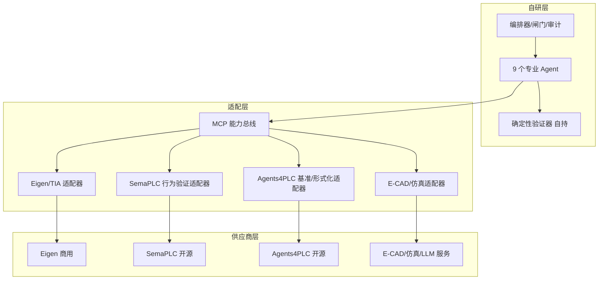

# 落实计划书：v1.1 架构为蓝图、Eigen 等业界产品为"预装组件"的实施计划

> 版本：v1.0（草案，供立项评审）
> 关联文档：`industrial-automation-ai-agent-closed-loop-architecture.md`（v1.1 架构）、`closed-loop-architecture-comparison.md`（三方对比）
> 战略结论（本计划书的出发点）：论架构，v1.1 增强版最优；论产品，Eigen 今天领先；最优路径是把 Eigen 们当作 v1.1 的"预装组件供应商"，而不是替代品。

## 执行摘要

本计划书把"以 v1.1 为蓝图、以业界产品为组件"的战略落成一条可执行的路线：**自研补全程、商用买时间、开源当备件、验证器自持**。四个阶段（约 6–10 个季度）内，把西门子 Eigen、美的 SemaPLC、浙大 Agents4PLC、RealPLC 等按"供应商"角色纳入 v1.1 的分层架构，同时守住两条红线：**任何供应商组件不得成为闸门或验证器的唯一依赖；所有工程资产保持文本化、可迁移，随时可替换供应商。**

## 1. 战略定位

1. **蓝图归属**：v1.1 架构（三闭环、六分层、A0–A3 分级、验证即门禁）是自研体系的目标形态，不向任何供应商让渡。
2. **组件策略**：业界产品按其覆盖环节，映射为 v1.1 中对应 Agent/验证器的"预装组件"——能用即买，缺了才造，坏了可换。
3. **正确性自持**：确定性验证器（编译/Lint/仿真/规范/形式化）是系统的裁决层，必须自研或开源自持，不外包给任何商用黑盒。
4. **供应商中立**：工程资产全部文本化/标准格式（IEC 61131-3 源码、结构化 IO 表、文档模板），经适配层进出各供应商工具，杜绝数据被绑死。

## 2. 组件供应商清单与映射

| 供应商/组件 | 映射到 v1.1 模块 | 角色定位 | 集成方式 | 许可与风险提示 |
| --- | --- | --- | --- | --- |
| 西门子 Eigen Engineering Agent | §3.4 控制程序生成、§3.5 HMI/SCADA | 商用替代候选（限 TIA 生态项目） | 与自研程序生成 Agent 同链路并行对照，择优切换 | 商业许可，绑定 TIA 生态 |
| 美的 SemaPLC | §3.6 仿真验证（行为验证） | 开源组件直接复用 | 抽取"强制输入 + 变量轨迹追踪"行为验证模块入仿真 Agent | 开源（MIT），自行维护 |
| 浙大 Agents4PLC | §7.2 验证引擎、§9 指标 | 基准与形式化验证来源 | 采用其 96 任务基准集作为验收集；引入 nuXmv/PLCverif 做高阶验证 | 学术开源，需工程化加固 |
| RealPLC TIA Agent | §3.4 内环（SCL 编译诊断修复） | 参考实现 | 复用其 TIA Openness 导入→编译→诊断→修复闭环链路设计 | 开源示例，需适配企业模板 |
| CERN × 西门子 vPLC 研究 | §7.3 云端编排+边缘执行 | 架构可行性证据 | 作为部署形态决策的参照，不直接采购 | 联合研究，非商用产品 |
| 通用 LLM 服务 | §7.1 模型 | 模型供应商（多路冗余） | 统一模型网关，主/备供应商切换 | 按数据合规选云/私有化 |
| EPLAN 等 E-CAD | §3.3 电气设计 | 工具供应商 | E-CAD API 适配器 | 商业许可，导出格式须开放 |
| SIMIT / Factory IO / TwinCAT 仿真 | §3.6 仿真平台 | 工具供应商 | 仿真适配器统一用例编排 | 商业许可，多平台并存 |
| CODESYS Automation Interface | §3.4/§7.3 程序生成 | 第二厂商通道（防锁定） | 与 TIA 通道同构的适配器 | 商业许可，开源生态较好 |

## 3. 采购/自研决策原则

**组件准入五问**（任一为"否"即不采购，改自研或换供应商）：

1. 接口能否被自动化调用（无人工点击环节）？
2. 产物能否导出为文本/标准格式并纳入我方版本库？
3. 数据是否本地可控、符合合规要求？
4. 许可是否允许多实例、自动化与审计？
5. 市场上是否存在开源替代或第二供应商？

**决策矩阵**：

| 情形 | 决策 |
| --- | --- |
| 组件覆盖环节成熟、接口开放、可替换 | 采购集成（Eigen 试用、仿真平台、E-CAD） |
| 组件覆盖但黑盒、锁死、不可导出 | 不采购；自研 + 开放工具（如 RealPLC 路线） |
| 组件仅覆盖片段、无闸门治理能力 | 采购片段 + 自研补齐治理（现状默认路径） |
| 属于裁决层（验证器） | 一律自研/开源自持，不外包 |

## 4. 集成架构（组件接入方式）

要点：Agent 只面向适配层编程，不直接调用供应商 API；验证器独立于供应商组件运行；每个适配器实现"导入/导出/校验"三接口，替换供应商 = 换适配器，不改 Agent。

## 5. 分阶段落实计划（示例节奏，自批准日起）

### 阶段一（第 1–2 季度）：单点试点 + 组件并行对照

| 项 | 内容 |
| --- | --- |
| 目标 | 控制程序生成单点跑通内环，完成 Eigen 对比评估 |
| 组件任务 | Eigen 试用采购/申请；部署 RealPLC 开源闭环作对照；引入 Agents4PLC 基准集建立验收集 |
| 自研任务 | 程序生成 Agent + TIA Openness/CODESYS 编译 Lint 验证器适配；工程资产版本库；需求解析试点 |
| 里程碑 | M1：基准集首生成编译 ≥80%；M2：Eigen 与自研双路对照报告（质量/成本/锁定度） |
| 验收 | 首次生成编译通过率 ≥80%、含内环修复后 ≥95%、Lint ≥90%（对应架构 §8.1） |

### 阶段二（第 3–4 季度）：全链工具 + 闸门体系上线

| 项 | 内容 |
| --- | --- |
| 目标 | 打通 E-CAD/仿真/HMI 全链，闸门与追溯库上线 |
| 组件任务 | 集成 SemaPLC 行为验证模块入仿真 Agent；采购仿真平台许可；E-CAD 适配器开发 |
| 自研任务 | 闸门引擎、全链路追溯库、双 Agent 评审、变更影响分析（图遍历）、模型版本治理（§7.5） |
| 里程碑 | M3：虚拟调试用例自动生成并执行；M4：追溯覆盖率 100% 的首个完整项目 |
| 验收 | 虚拟调试缺陷密度较 3 年人工基线 -30%、现场调试工时 -30%（§8.2） |

### 阶段三（第 5–8 季度）：受限全自动试点（A2）

| 项 | 内容 |
| --- | --- |
| 目标 | 标准产线/成熟行业改造项目 A2 试点，规则化闸门自动放行 |
| 组件任务 | 供应商 SLA 签订；组件版本冻结与回归测试流程上线；LLM 主/备供应商切换演练 |
| 自研任务 | 规则化闸门引擎、审计导出、知识库冷启动入库（模板 ≥20、案例 ≥30） |
| 里程碑 | M5：首个 A2 试点项目交付；M6：供应商切换演练 ≤1 工作日恢复 |
| 验收 | 闸门外人工介入 ≤2 次/项目、无 Agent 缺陷导致停机、审计无未留痕介入（§8.3） |

### 阶段四（第 9 季度起）：学习型全自动闭环（A3）

| 项 | 内容 |
| --- | --- |
| 目标 | 运行闭环接通、学习管线常态化、组件生态多云化 |
| 组件任务 | 运维数据接入（OPC UA/时序库）；评估第二供应商/开源替代形成双通道 |
| 自研任务 | 运维 Agent、学习管线、行业模板扩展 |
| 里程碑 | M7：首个优化提案全闭环（生成→仿真→审批→部署）；M8：模板复用率 ≥60% |
| 验收 | 项目周期缩短 ≥40% 持续两季度、案例库季度增量达标（§8.4） |

## 6. 组织与治理

| 角色 | 人数（示例） | 职责 |
| --- | --- | --- |
| 架构负责人 | 1 | 蓝图守门：供应商组件不得侵入闸门/验证器/资产格式 |
| Agent 工程组 | 2–3 | Agent 与适配器开发、提示词版本治理 |
| 验证器组 | 1–2 | 编译/Lint/仿真/形式化验证器自持与加固 |
| 知识治理工程师 | 1 | 模板/案例库冷启动与审核（抽检 ≥20%） |
| 供应商管理（兼） | 1 | 准入五问、SLA、版本冻结与回归、退出预案 |
| 闸门裁决人（资质工程师） | 若干 | SIL 终审、方案评审、验收签字（不可外包） |

治理机制：组件准入走五问评审；组件版本升级先回归后上线（复用 §7.5 机制）；每阶段结束 Go/No-Go 评审；供应商中断演练每半年一次。

## 7. 预算与资源（示例口径，立项前按企业实际重算）

| 项目 | 估算 | 说明 |
| --- | --- | --- |
| 平台开发/集成（自研人力+适配器） | ¥80–150 万 | 沿用架构 §8.5 |
| 组件采购 | ¥25–65 万 | Eigen 试用/许可（询价）、仿真平台、E-CAD API、模型 API |
| 工程软件许可 | ¥20–50 万 | 已有则不计 |
| 算力与基础设施 | ¥10–30 万 | 边缘节点 + 模型推理 |
| 培训与变革管理 | ¥5–15 万 | 工程师转型培训 |
| 合计 | ¥140–310 万 | 回收期 1.5–2.5 年（10 项目/年） |

## 8. 关键风险与对策

| 风险 | 对策 |
| --- | --- |
| 供应商锁定（Eigen/TIA 生态） | 资产文本化 + 适配层隔离 + CODESYS 第二通道 + 开源替代（SemaPLC/RealPLC）常备 |
| 商用组件版本升级破坏已交付项目 | 版本冻结 + 升级前回归验证 + 主/备供应商切换演练 |
| 商用黑盒无法解释裁决 | 验证器自持，供应商组件只做生成、不做放行 |
| 数据出境与合规 | 涉密项目全私有化；跨项目检索脱敏；许可合同锁定数据条款 |
| 供应商停服/涨价 | 开源备件清单 + 资产可迁移性年检（迁移演练） |
| 组件与自研职责推诿 | 责任边界写入合同与流程：生成责任归组件/Agent，放行责任归我方验证器与闸门 |

## 9. 里程碑与 KPI

里程碑：M1–M8 见第 5 节（按季度评审一次）。

| KPI | 定义 | 目标 |
| --- | --- | --- |
| 组件覆盖率 | v1.1 模块中由外部组件承担的比例 | 阶段一 ≥20%，阶段二 ≥40%，封顶 60%（治理与裁决层永不外包） |
| 锁定指数 | 任一供应商中断后恢复运转的时间/成本 | ≤1 工作日 / ≤2 人周（演练验证） |
| 基准回归通过率 | Agents4PLC 基准集 + 自有回归集通过率 | ≥90% 且不劣化 |
| 资产可迁移性 | 可导出为文本/标准格式的资产占比 | 100% |
| 架构 KPI | 首次生成编译 ≥80%、修复后 ≥95%、缺陷密度 -30%、闸门外介入 ≤2 次 | 同架构 §9 |

## 10. 决策点与退出机制

- **Go/No-Go 评审**：每阶段结束按 §5 验收条件评审；不达标不进入下一阶段。
- **Eigen 决策点**（阶段一末）：双路对照数据决定"采购集成 / 仅对标 / 弃用"，三者均有预案。
- **组件替换预案**：每个采购组件在准入时同步确定开源/自研替代路径；触发条件（停服、涨价超阈值、版本事故）写入供应商管理台账。
- **整体降级**：任何安全事故或重大质量事故即回退自动化等级并复盘（沿用架构 §8 铁律）。

## 附录 A：供应商信息快照

- 西门子 Eigen Engineering Agent（2026 商用，WAIC SAIL 之星奖）：[官方发布](https://www.automation.com/article/siemens-eigen-engineering-agent-purpose-built-ai-industrial-automation-engineering)、[社区介绍](https://community.xcelerator.siemens.com/public/blogs/meet-eigen-the-ai-agent-that-actually-knows-your-tia-project-2026-05-04)
- 美的 SemaPLC（开源 agentic IDE，MIT）：[GitHub](https://github.com/midea-ai/SemaPLC)
- 浙大 Agents4PLC（arXiv:2410.14209，96 基准任务，形式化验证）：[论文](https://huggingface.co/papers/2410.14209)、[GitHub](https://github.com/Luoji-zju/Agents4PLC_release)
- RealPLC TIA Agent（TIA Openness 闭环参考实现）：[介绍](https://cloud.tencent.com.cn/developer/article/2705392?policyId=1003#1)、[实践](https://cloud.tencent.com.cn/developer/article/2709090?policyId=1004)
- CERN openlab × 西门子 vPLC 联合研究（非商用）：[活动资料](https://openlab.cern/siemens-industrial-edge-cloud-and-ai-based-agents/)
